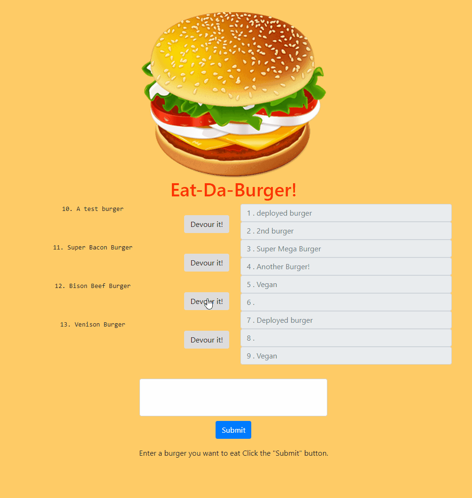
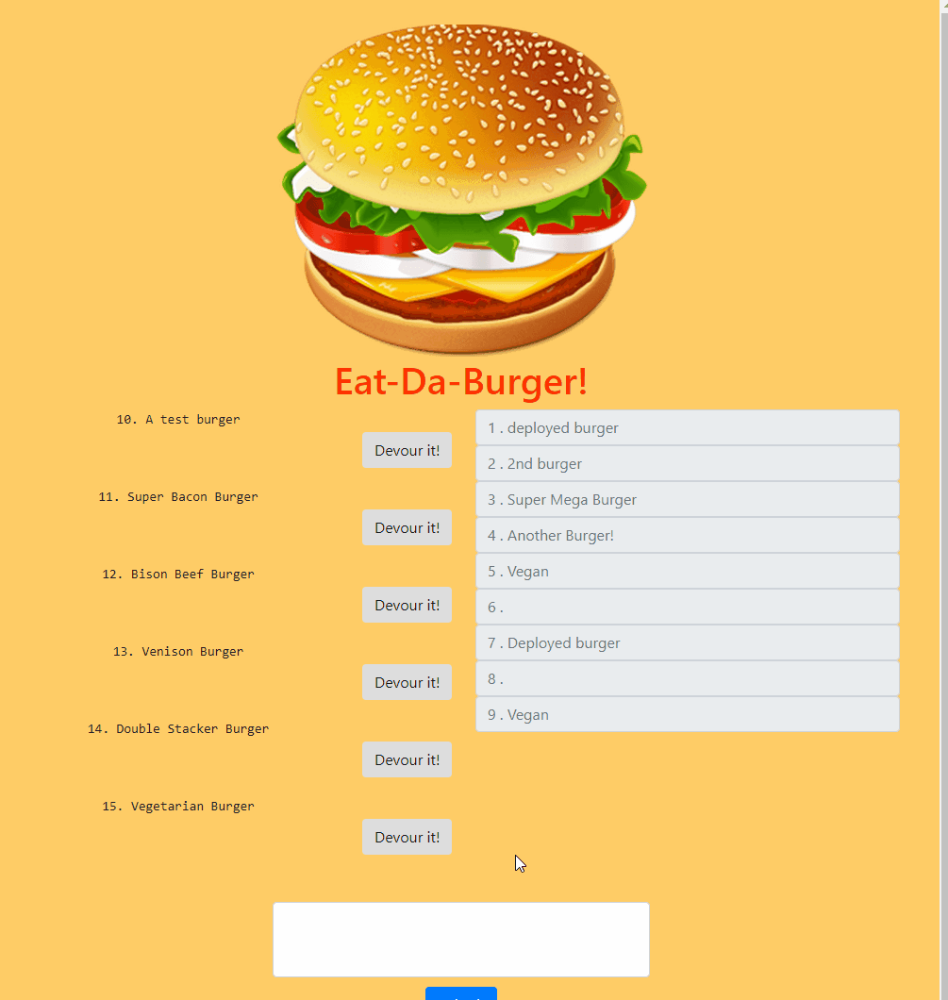

# Eat Da Burger!

##  About this project

For this project I created a "burger logger" with MySQL, Node, Express, Handlebars and a homemade ORM (yum!). Add a burger to your list, then devour it! The burger will be added to a "devoured" list.

Deployed app! (https://pacific-mountain-19885.herokuapp.com/)

##  Getting started

To use Eat-Da-Burger web application application from your local environment, you must accomplish the following steps below:

<table>
  <tr>
    <th colspan="3">Terminal Bash Steps</th>
  </tr>
  <tr>
    <td align="center" style="width: 75px;">Step #</td>
    <td align="center" style="width: 330px;">Description</td>
    <td  align="center" >Terminal Bash Command</td>
  </tr>
  <tr>
    <td align="center">01</td>
    <td>Clone this repo</td>
    <td>git clone https://<i></i>https://github.com/rhgcodes/burger.git</td>
  </tr>
  <tr>
    <td align="center">02</td>
    <td>Install required NPM packages</td>
    <td>npm i</td>
  </tr>
  <tr>
    <td align="center">03</td>
    <td>Change directory to the cloned repo folder</td>
    <td>cd burger</td>
  </tr>
    <tr>
    <td align="center">04</td>
    <td>Open MySQL</td>
    <td>create schema</td>
  </tr>
  <tr>
    <td align="center">05</td>
    <td>Start the application</td>
    <td>npm start</td>
  </tr>
  </table>

##  Technologies used to build app

  * CSS3 and HTML5
  * Handlebars
  * Javascript
  * Node.js (https://nodejs.org/en/)
  * Express 
  * MYSQL NPM Package (https://www.npmjs.com/package/mysql)

##  Demos

### Adding Burgers

### Devouring Burgers

## Author

* Ruben Galleguillos - *JS/MySQL/Express/Node.js* - [Ruben Galleguillos](https://github.com/rhgcodes)